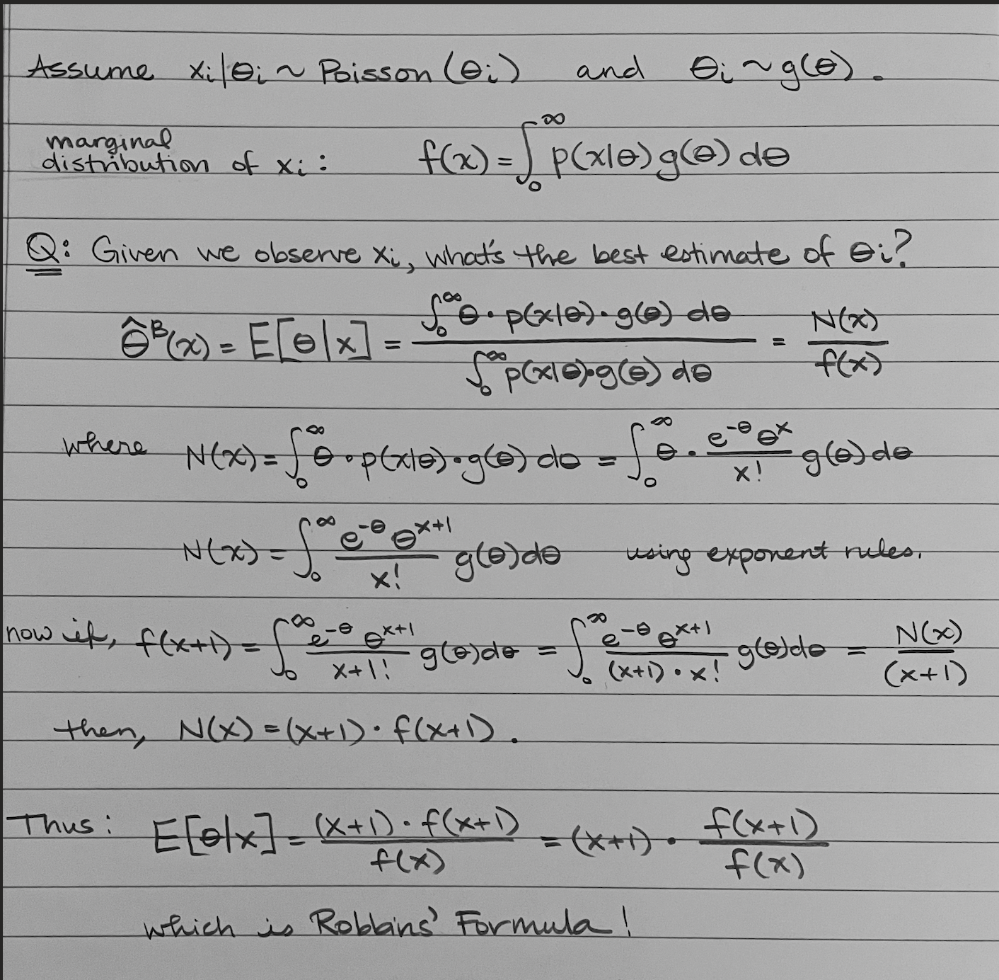

# I. Orientation & Context

## 1a. Text Selection & Rationale

I chose to research empirical Bayes through reading Chapter 6 in *Computer Age Statistical Inference: Algorithms, Evidence, and Data Science* by Efron and Hastie. I was drawn to this topic because, after a conversation with a networking contact where we discussed various concepts within Bayesian statistics, I found the idea that the data can be its own prior distribution quite surprising. This chapter of Efron and Hastie's book was a good place to start because it gives a high-level overview and brings the topic into the current computer age. 

## 1b. Text Overview

The reference text, Chapter 6 of CASI, gives a high-level overview of empirical Bayes. It begins by introducing Robbins' formula, which allows one to use the empirical distribution of one’s observed data to estimate what the prior distribution should be. This is crucial to the use of empirical Bayes, which sits in the middle of true Bayes' theorem and a frequentist solution where no prior information is used. The text then examined three examples: a butterfly missing species problem, the vocabulary of Shakespeare's canon as a missing species problem, and a medical example regarding cancer surgeries. It addresses these problems using the non-parametric Robbins' formula approach, as well as a parametric approach using the Gamma-Poisson conjugate model. 

## 1c. Intended Audience & Field Context of the Text

Empirical Bayes is an interesting topic that sits within Bayesian inference. The book, Computer Age Statistical Inference, was written with statisticians, data scientists, and other quantitative researchers working with large data sets in mind. This paper is written for the same audience as my understanding of the topic. Empirical Bayes matters because it blends Bayesian and frequentist methods. In the world today, when we want to predict many outcomes at once, empirical Bayes offers a statistically proven way to do that using Bayesian reasoning without forcing a subjective prior and instead using the observed data you have. Today, empirical Bayes methods are used on large-scale inference problems in fields like sports analytics, genomics, and e-commerce.


## 1d. Reading Strategy

I started by reading the introduction and looking at the chapter's headings and figures to get oriented. After that, I began reading the chapter in full and taking notes as I read. Along the way, I asked some questions of AI for clarification of topics mentioned, like the Robbins' formula. After a complete first reading, I went back to the formulas to attempt to better understand them. I only skimmed section 6.5 Notes and Details.


# II. Conceptual Engagement

## 2a. Core Idea(s) Explained

Empirical Bayes solves a fundamental dilemma in Bayesian inference. When we use traditional Bayesian methods, there needs to be a defined prior distribution, often chosen subjectively, to calculate the posterior distribution. The goal of empirical Bayes is to instead use the observed data itself to estimate the prior distribution.
\

Using Robbins' Formula as part of non-parametric empirical Bayes, Efron and Hastie show how to extract the prior distribution directly from the empirical distribution of many observations. This approach requires a large sample size to work well. Once the prior distribution is estimated based on the observed data, standard Bayesian methods can be applied to the problem. Alternatively, a parametric approach to empirical Bayes is also possible by maximizing the marginal likelihood to estimate the parameters. 
\

An example from Efron and Hastie analyzes Shakespeare's canon and vocabulary as a missing species problem. Researchers want to know: how many words did Shakespeare know that he never used in his written works? The Shakespearean canon contains 884,647 words in total, with 31,534 distinct words appearing at least once. Efron and Hastie estimate how many new distinct words might appear if an additional canon of similar size were discovered. The answer is found by using the observed frequencies (i.e., 14,376 words appear only once, 4343 words appear twice each) to estimate what the underlying distribution of Shakespeare's vocabulary should be. This example, along with a couple others, illustrates the core insight of empirical Bayes, which is that it borrows strength from many observations to make better estimates of each individual case, without requiring a subjectively chosen prior.

## 2b. What You Understood vs. What Remained Opaque

While the core intuition of empirical Bayes became clear through Efron and Hastie's examples, several technical and conceptual aspects require deeper understanding. Below, I distinguish what I grasped confidently from what remains opaque and identify specific work needed to close those gaps.

### What I Clearly Understand:

I believe I fully understand the big picture of empirical Bayes. The key distinction that makes this method a bridge between frequentist beliefs and true Bayesian statistics is that the observed data is going to be used to estimate its own prior distribution. In frequentist statistics, there is no prior information used, just what you have now. In true Bayesian statistics, you must select a prior before seeing the data and based on prior knowledge. This is often a very subjective decision. When subjective prior selection is impractical, empirical Bayes uses the observed data twice: once to estimate the prior, then again to calculate the posterior.
\

Robbins' formula is a critical step in the process, as this is what allows the manipulation of the observed data into an estimated prior. The formula takes the empirical distribution of the observed data to estimate the prior distribution. The formula in its complete form is quite simple to use to get the resulting expectation. 
\

There are quite a few applications of Robbins' formula seen in the text, from missing species problems (about butterflies and vocabulary) to medical data about cancer. Both missing species problems show clear final steps of using Robbins' formula to reach an expectation for the unknown question. It is interesting to see the result, how it can be interpreted, and how far into the future it is reliable. The text mentions the need to be careful about extrapolation and guessing too far into the future. I can see that the importance of this concept overall is that in all walks of life people are wondering about the future and what may happen based on what they know so far. The use of this formula is a way to postulate about the future using the data you have on what is occurring now. 


### What Remains Opaque or Partially Understood: 

**1. Mathematical Derivation of Robbins' Formula**

A few topics remain slightly unclear after reading. First, the mathematical derivation of the Robbins' formula. I understand that it uses the empirical distribution of the observed data to estimate the prior, but I did not work through the mathematical derivation. The chapter presents the formula for expectation on page 80 and the process to get there in the pages leading up to it. I generally understand how the formula comes to be, but for a full understanding, I would need to work through the derivation step-by-step with all the details since it seemed like some of the intermediate steps were skipped over in the text. Ideally, I could verify it from the text or create a simple example in R. For now, I am trusting Efron and Hastie that the derivation is correct. 
\

**2. Philosophical Concern: Using Data Twice**

Second, the whole idea behind empirical Bayes is that the observed data is used twice: once to estimate a prior distribution and then again to calculate the posterior. While the ability to do this is amazing, it is still a little unclear to me as to how it is okay to use the data twice. I would like to find another source that explains in more detail why this doesn't introduce bias into the result, because this chapter doesn't delve into the reasoning behind why it’s okay, just that it is okay and that it optimizes the result.  
\

**3. Parametric vs. Non-Parametric Empirical Bayes**

Third, the chapter discusses parametric and non-parametric empirical Bayes. I understand that Robbins' formula is used in non-parametric empirical Bayes to estimate the prior, and specific distributions (like normal, binomial, gamma) are used in parametric empirical Bayes for the prior distribution and to estimate its parameters. From the examples given, both methods gave similar results when used on the same problems. I remain curious and unclear on when each should be used over the other, and what the limitations of each are. Working through coding an example in R to compare methods would be interesting to further my understanding of the details and implementation of each method. 

## 2c. A Question the Text Raises for You

Chapter 6 provides a straightforward, high-level introduction to empirical Bayes with concrete examples (missing species and medical data). However, these examples feel somewhat simplified and idealized compared to the messy data we know is out there. I noticed from conversations with AI, internet searches, as well as the subsequent chapters in CASI (Chapter 7: James-Stein Estimation and Ridge Regression; Chapter 8: Generalized Linear Models; Chapter 9: Survival Analysis) that empirical Bayes can scale to more complex settings. This brings me to the biggest question that I am left with after reading: What additional assumptions or methods are needed to handle messy and more complex data? Do the methods, assumptions, or theoretical foundations in this chapter change at all? For instance, how does empirical Bayes extend to data with hierarchical structure, where the assumption of exchangeable $\theta_i$'s may not hold?
\

Before researching this big question that the text raised for me, I began by addressing the topics I partially understood from the reading by using additional resources and working through the derivation of Robbins' formula in detail.

# III. Self-Directed Learning

To further my learning and understanding of empirical Bayes, I chose to delve deeper into Robbins' formula and the non-parametric approach. This seemed an important conceptual foundation to have in order to understand more complicated methods based on the foundation of this formula. 

## 3a. Outside Resources Consulted

- **Efron, B., & Hastie, T. (2016).** *Computer Age Statistical Inference*, Chapter 6.  

This was my primary reference material throughout my research. It gave me a high-level overview of empirical Bayes with concrete examples. As I dove further into the topics within, I realized how much detail and substance there was. 

- **Penn State STAT 555, Lesson 40: Empirical Bayes**  (http://online.stat.psu.edu/stat555/node/40/)

This provided me with an alternative explanation of Bayesian statistics concepts. The focus was more on the full Bayesian approach rather than empirical Bayes, but it allowed to better understand the differences between the two methods and how empirical Bayes differs. 

- **YouTube: Empirical Bayes**  (https://www.youtube.com/watch?v=6t4FYT-HvzY)  

This video was a very brief, high-level introduction. It did provide me with examples of how empirical Bayes is used today in the world and in business.
  
- **Wikipedia: Empirical Bayes Method**  (https://en.wikipedia.org/wiki/Empirical_Bayes_method)  

This was used as another source to compare formulas in my understanding of the derivation of Robbins' formula. It also gave another example to understand the application of empirical Bayes and Robbins' formula. 

- **AI Conversations (Claude)** 

These conversations helped me work through the Robbins' formula derivation step by step, allowing me to ask questions at each stage and identify exactly where my understanding broke down. It also provided clarification distinguishing empirical from traditional Bayes and thinking through the "using data twice" concern. 

## 3b. A Concept You Taught Yourself

Upon reading this text, I had never heard of Robbins' formula. During my reading, I felt like I understood the overall idea of the formula and its importance to the empirical Bayes methodology, but the details were not clear. I decided to take some time to really dive into it by writing out the derivation of the formula by hand, as well as learning how to implement it in R. 
\

**What I Learned:**

From reading, I learned that Robbins' formula estimates the prior by leveraging the marginal likelihood. To really understand what that meant, I hand-wrote the steps of how to get from the initial distribution to the formula itself. I followed the steps from the textbook, beginning with a variable following the Poisson distribution, and reached the expectation of the true rate value based on the observation. Here is a shortened version, with a much longer and more descriptive derivation process in the GitHub repo (`notes/robbins_derivation_full.pdf`) for the complete hand-written derivation. 
\

The key insight in deriving this formula is that we don't need to assume a parametric form for $g(\theta)$. Instead, the empirical distribution of observed counts directly tells us what the prior should be, which is really cool!

```{r, echo=FALSE, fig.align='center', out.width='75%'}

```

To verify this understanding, I implemented Robbins' formula in R on the Shakespeare data. This code was not complicated, but I did have AI help me write it. Once you define your data, it's just creating a function for the Robbins' formula, which could then be used on other datasets as well. 

```{r, echo=FALSE}
word_freq <- c(14376, 4343, 1100, 450, 213, 112, 70, 62, 42, 37)
counts <- 1:length(word_freq)
names(word_freq) <- counts
total_distinct <- sum(word_freq)
f_hat <- word_freq / total_distinct
```

```{r, echo=TRUE}
# Robbins' Formula for Shakespeare data
robbins_formula <- function(x, f_hat) {
  posterior_means <- numeric(length(x))
  for (i in seq_along(x)) {
    x_i <- x[i]
    if (x_i + 1 > length(f_hat) || f_hat[x_i] == 0) {
      posterior_means[i] <- NA
      next
    }
    posterior_means[i] <- (x_i + 1) * f_hat[x_i + 1] / f_hat[x_i]
  }
  return(posterior_means)
}

# Apply to Shakespeare
results <- data.frame(
  observed_count = 1:9,
  robbins_estimate = robbins_formula(1:9, f_hat)
)
```

```{r, echo=FALSE}
print(results)
```

These results show the shrinkage that happens when you use the Robbins' formula. To estimate the true rate of these less frequently used words in Shakespeare, we borrow some information from the rest of the data and its distribution. For example, we see in the results that words observed only once (14,376 of them) get a Robbins estimate of 0.604, and words observed nine times (37) get a Robbins estimate of 8.81. The words that are seen more frequently get less shrinkage because they are more stable than words that appear infrequently, pulling the rarer observations more toward the mean of the distribution. The full code files for this process are in the GitHub repository.
\

Working through the derivation showed me that Robbins' Formula isn't magic; it's a natural consequence of Bayesian reasoning applied to the marginal likelihood. Implementing it in code with the Shakespeare example from the text showed how empirical frequencies translate to shrinkage estimates in practice. This helped me move from seeing this formula on faith to understanding why it works and what it is doing. 


## 3c. A Plan for Further Study

To truly master empirical Bayes, I would pursue these next steps with additional time. 
\

First, I would like to look further into the other topics within this chapter that I identified I only partially understood. I now feel as though I understand the non-parametric approach to empirical Bayes through Robbins' formula well, so I would like to explore the parametric approach. I will explore the parametric approach to Empirical Bayes by studying the Gamma-Poisson conjugate model, which is introduced in Chapter 6 of CASI as the parametric counterpart to Robbins' formula. I will work through the derivation of the posterior mean under a Gamma prior, similar to how I methodically went through the steps for Robbins', verify that it produces the same result as Robbins' formula, and implement it on a concrete dataset. As a secondary source, I will reference Casella (1985), "An Introduction to Empirical Bayes Data Analysis" in The American Statistician.
\

Next, I would like to read and study the foundational Efron & Morris (1973) paper "Stein's Estimation Rule and Its Competitors" to understand how James-Stein shrinkage is reinterpreted as an empirical Bayes estimator under a normal prior and implement it on the baseball data. This would also give me the chance to look at how these methods perform on a more complex data set. For this topic of the James-Stein estimation, I can also reference Chapter 7 in CASI, which would also take me through the connection to Ridge regression. 
\

Lastly, another topic I was unclear about was the 'using data twice' concern. After a bit of research, I better understand that it is justified asymptotically and pragmatically rather than philosophically. However, I would like to explore this more carefully. Specifically, I want to understand the conditions under which the bias introduced by estimating the prior from data is limited, and what we sacrifice compared to a fully Bayesian approach. For this, I will investigate reading Carlin & Louis (2000), which directly addresses the double use of data and its consequences for uncertainty quantification, and Morris (1983) 'Parametric Empirical Bayes Inference' in JASA, which provides the theoretical justification for when marginal likelihood EB is valid.
\

Together, these topics will help me better understand empirical Bayes as not a philosophically clean Bayesian procedure, but as a principled frequentist approximation with known limitations.


---

# Appendix

## References

- Efron, B., & Hastie, T. (2016). *Computer Age Statistical Inference: Algorithms, Evidence, and Data Science*. Cambridge University Press.

- Penn State STAT 555, Lesson 40: Empirical Bayes. Retrieved from http://online.stat.psu.edu/stat555/node/40/

- Wikipedia: Empirical Bayes Method. Retrieved from https://en.wikipedia.org/wiki/Empirical_Bayes_method

- YouTube: Empirical Bayes [Video]. Retrieved from https://www.youtube.com/watch?v=6t4FYT-HvzY


## Notes on AI Use

I used Claude (Anthropic) to assist with the following in two different chats:

- Clarifying the distinction between empirical and traditional Bayesian inference during my initial reading.

- Thinking through the philosophical concern of "using data twice" and why it is justified asymptotically.

- Working through the derivation of Robbins' formula step by step, asking questions at each stage to identify gaps in my understanding. My hand-written derivation notes were informed by this conversation, but working through each step myself led to a deeper understanding.

- For reviewing and giving feedback on drafted sections of this paper. It was used during the planning and structural stages of the paper, including organizing Section 2b and the further study plan in Section 3c. Then, a second Claude conversation was used for paper review and feedback, including suggestions that led to revisions in sections 1b, 1c, 2c, and the transition between sections II and III.

**What I did:** I treated Claude as an interactive study partner rather than a content generator. I asked questions, pushed back, and used responses to direct further reading and thinking. I also used it to prompt me through the project stages step by step. 

**My contribution:** All final writing, analysis, and reasoning in this paper are my own. I consulted AI for clarification and brainstorming, not for generating content. A few sentences may have come from my conversations, but I worked to edit the text to make sure it was accurate to my understanding of the project. 

See the GitHub repo (`ai_transcripts/` folder) for the full conversation transcripts.


## GitHub Repository

**This paper's supporting materials are available at:** https://github.com/mlivauda/677-Final-Project
